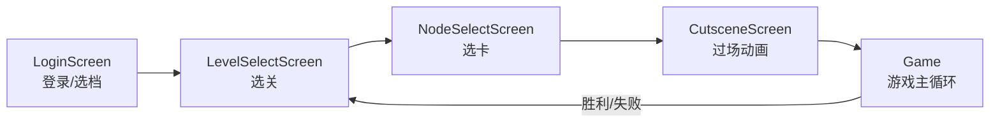
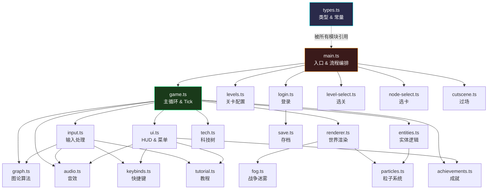
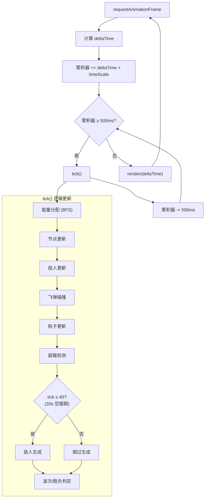
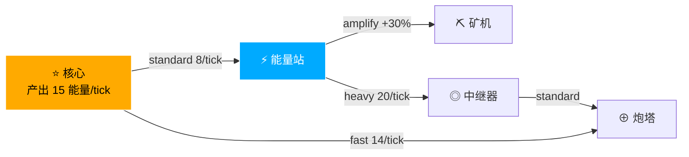
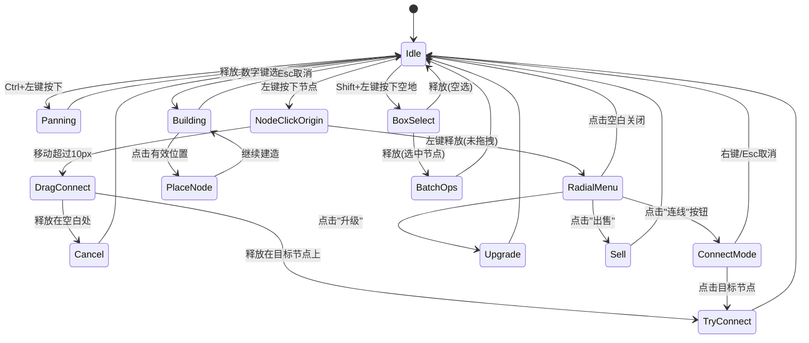
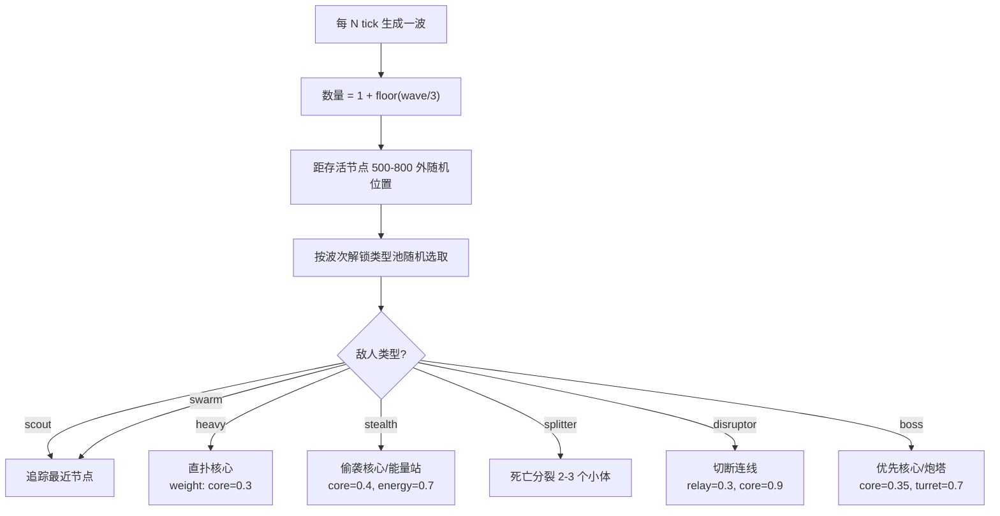
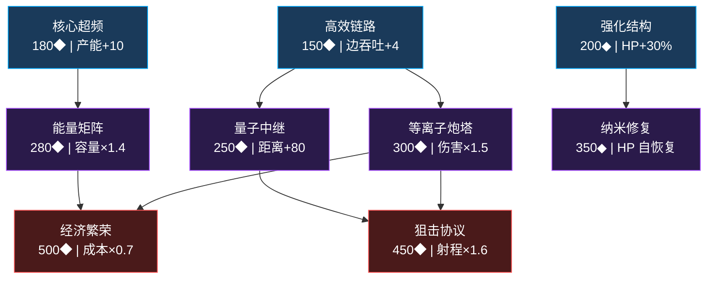
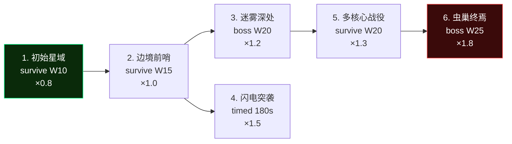

# 架构图

> 以下为 [Mermaid](https://mermaid.js.org/) 格式图表，可在 GitHub / VS Code Mermaid 插件中直接渲染。

---

## 1. 游戏流程

---

## 2. 模块依赖关系

---

## 3. 游戏主循环 (Game Loop)

---

## 4. 能量流动系统

---

## 5. 输入交互状态机

---

## 6. 敌人生成与AI

---

## 7. 科技树

---

## 8. 关卡解锁路径

